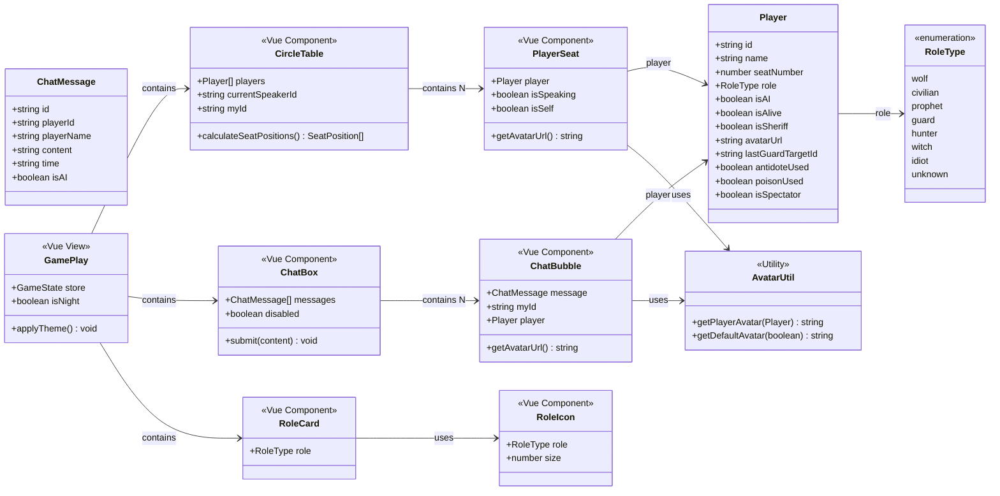
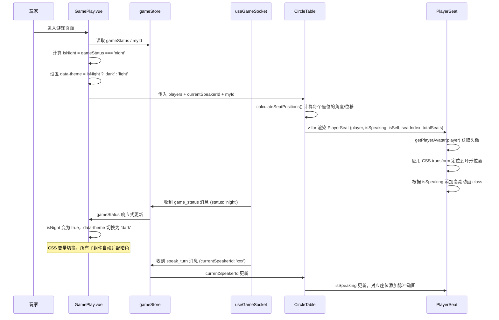
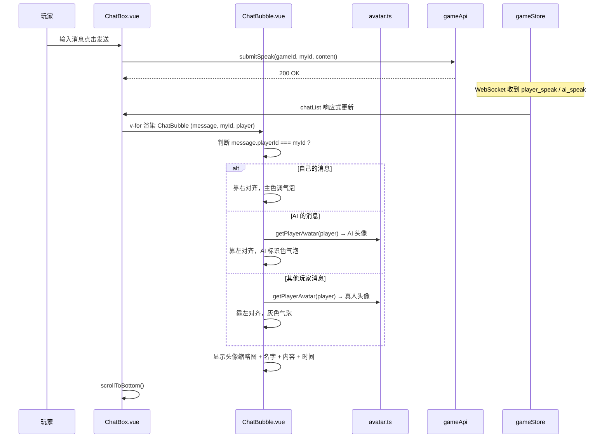
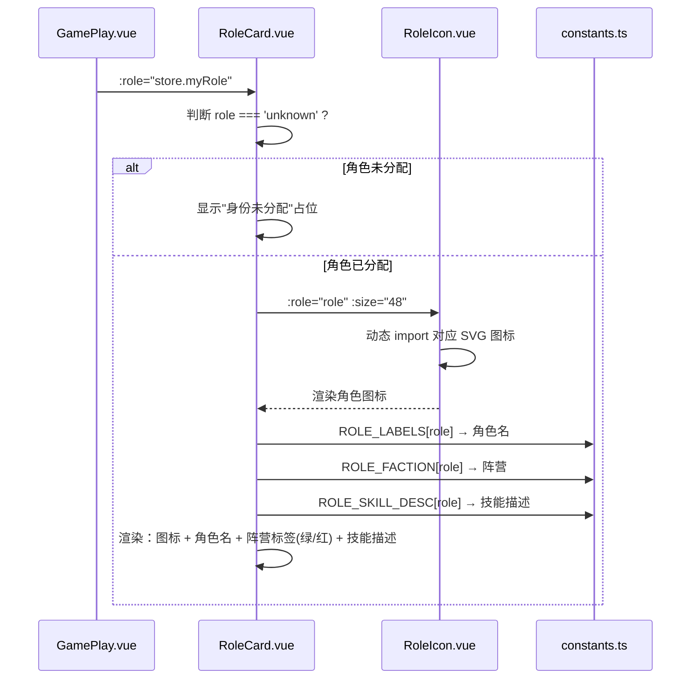
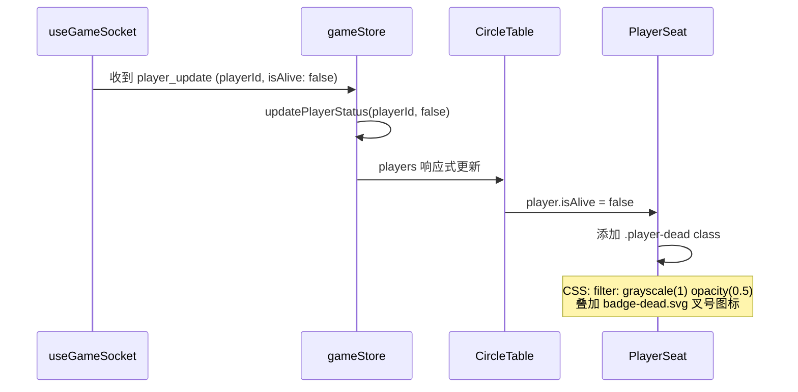
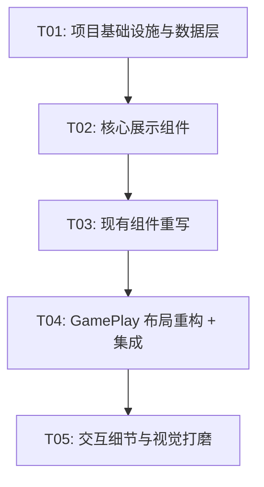

# WolfBot 头像系统与前端 UI 改造 — 系统架构设计

> 架构师：高见远（Gao） | 版本：v1.0 | 日期：2025-07

---

## Part A: 系统设计

### 1. 实现方案

#### 1.1 核心技术挑战

| 挑战 | 难度 | 解决策略 |
|------|------|----------|
| 圆桌环形布局 | ⭐⭐⭐ | CSS `transform: rotate() translateX() rotate()` 三段变换，不引入第三方布局库；自坐固定 6 点钟，其余顺时针 |
| GamePlay 三段式布局重构 | ⭐⭐ | 从 CSS Grid 两栏 → Flexbox 三段（顶栏 + 中央 + 底栏），中央区域 `flex: 1` 自适应，底栏 `position: sticky` |
| 昼夜主题切换 | ⭐⭐ | CSS 变量 + `data-theme` 属性切换，配合 `transition: all 0.5s` 渐变过渡 |
| 发言者高亮动画 | ⭐ | CSS `@keyframes pulse-glow` + `box-shadow` 脉冲，通过 `:class` 绑定 `currentSpeakerId` |
| 死亡玩家视觉标识 | ⭐ | `filter: grayscale(1) opacity(0.5)` + 叠加红色 ✕ SVG |
| ChatBox 气泡样式 | ⭐⭐ | 重写消息渲染逻辑，根据 `playerId === myId` / `isAI` 分三种对齐方式 |

#### 1.2 框架与库选型

| 类别 | 选型 | 理由 |
|------|------|------|
| UI 框架 | Element Plus（现有） | 约束：不引入新 UI 框架 |
| 样式方案 | CSS 变量 + scoped CSS | 暗色主题通过变量切换，无需 CSS-in-JS |
| 环形布局 | 纯 CSS transform | 约束：不引入新 npm 包 |
| 图标/头像 | 内联 SVG + SVG 文件 | 轻量、可主题化、无网络请求 |
| 状态管理 | Pinia（现有） | 无变更 |
| 构建工具 | Vite（现有） | 无变更 |

#### 1.3 架构模式

沿用现有 MVVM 模式（Vue3 + Pinia），不改变数据流方向。组件拆分遵循 **容器-展示** 分离：

- **容器组件**：GamePlay.vue、PlayerList.vue — 负责数据获取与状态管理
- **展示组件**：PlayerSeat.vue、CircleTable.vue、ChatBubble.vue、RoleIcon.vue — 纯 props 驱动

---

### 2. 文件列表

#### 2.1 新增文件

| 相对路径 | 说明 |
|----------|------|
| `frontend/src/components/game/PlayerSeat.vue` | 单个座位卡片组件（头像+名字+状态角标） |
| `frontend/src/components/game/CircleTable.vue` | 圆桌容器组件（环形排列逻辑） |
| `frontend/src/components/common/ChatBubble.vue` | 单条聊天气泡组件 |
| `frontend/src/components/common/RoleIcon.vue` | 角色图标组件（根据 RoleType 渲染 SVG） |
| `frontend/src/utils/avatar.ts` | 头像计算工具函数 |
| `frontend/src/assets/avatars/avatar-human.svg` | 真人默认头像 |
| `frontend/src/assets/avatars/avatar-ai.svg` | AI 机器人头像 |
| `frontend/src/assets/avatars/role-wolf.svg` | 狼人角色图标 |
| `frontend/src/assets/avatars/role-civilian.svg` | 平民角色图标 |
| `frontend/src/assets/avatars/role-prophet.svg` | 预言家角色图标 |
| `frontend/src/assets/avatars/role-guard.svg` | 守卫角色图标 |
| `frontend/src/assets/avatars/role-hunter.svg` | 猎人角色图标 |
| `frontend/src/assets/avatars/role-witch.svg` | 女巫角色图标 |
| `frontend/src/assets/avatars/role-idiot.svg` | 白痴角色图标 |
| `frontend/src/assets/avatars/role-unknown.svg` | 未知角色图标 |
| `frontend/src/assets/avatars/badge-sheriff.svg` | 警长徽章图标 |
| `frontend/src/assets/avatars/badge-dead.svg` | 死亡标记图标 |
| `frontend/src/styles/theme-dark.css` | 暗色主题 CSS 变量定义 |
| `frontend/src/styles/theme-light.css` | 浅色主题 CSS 变量定义（提取现有颜色） |

#### 2.2 修改文件

| 相对路径 | 修改内容 |
|----------|----------|
| `frontend/src/types/game.ts` | Player 接口增加 `avatarUrl?: string` |
| `frontend/src/utils/constants.ts` | 增加 `ROLE_FACTION`、`ROLE_SKILL_DESC`、`FACTION_LABELS` 常量 |
| `frontend/src/assets/css/main.css` | 引入 theme CSS 变量文件 |
| `frontend/src/components/game/PlayerList.vue` | 重写：从 el-tag 列表 → CircleTable + PlayerSeat |
| `frontend/src/components/common/ChatBox.vue` | 重写：加入气泡样式 + 头像 + 自己/AI/他人区分 |
| `frontend/src/components/common/RoleCard.vue` | 重写：角色图标 + 阵营标签 + 技能描述 |
| `frontend/src/views/GamePlay.vue` | 重写：三段式布局 + 暗色主题切换 + 中央公告 |
| `backend/app/schemas/player.py` | Player schema 增加 `avatar_url` 可选字段 |

---

### 3. 数据结构与接口

#### 3.1 类图



#### 3.2 组件 Props / Emits 详细定义

**PlayerSeat.vue**

```typescript
// Props
interface PlayerSeatProps {
  player: Player;          // 玩家数据
  isSpeaking: boolean;     // 是否当前发言者
  isSelf: boolean;         // 是否是自己
  seatIndex: number;       // 在环形中的索引位置（用于 CSS transform）
  totalSeats: number;      // 总座位数（用于计算角度）
}

// 无 emits，纯展示组件
```

**CircleTable.vue**

```typescript
// Props
interface CircleTableProps {
  players: Player[];           // 所有玩家
  currentSpeakerId: string | null;  // 当前发言者 ID
  myId: string;                // 自己的 ID
}

// Emits
interface CircleTableEmits {
  'seat-click': [playerId: string];  // 点击座位（为 P1 投票/夜间操作预留）
}
```

**ChatBubble.vue**

```typescript
// Props
interface ChatBubbleProps {
  message: ChatMessage;    // 消息数据
  myId: string;            // 自己的 ID（区分自己/他人）
  player: Player | undefined;  // 发送者玩家数据（用于头像）
}

// 无 emits，纯展示组件
```

**RoleIcon.vue**

```typescript
// Props
interface RoleIconProps {
  role: RoleType;    // 角色类型
  size?: number;     // 图标尺寸，默认 40
}

// 无 emits，纯展示组件
```

**RoleCard.vue（重写后）**

```typescript
// Props
interface RoleCardProps {
  role: RoleType;    // 当前角色
}

// 无 emits，纯展示组件
```

#### 3.3 工具函数定义

**avatar.ts**

```typescript
import avatarHuman from '@/assets/avatars/avatar-human.svg';
import avatarAI from '@/assets/avatars/avatar-ai.svg';
import type { Player } from '@/types/game';

/**
 * 获取玩家头像 URL
 * 优先级：自定义 avatarUrl > AI 默认头像 > 真人默认头像
 */
export function getPlayerAvatar(player: Player): string {
  if (player.avatarUrl) return player.avatarUrl;
  return player.isAI ? avatarAI : avatarHuman;
}

/**
 * 获取默认头像（按 isAI 区分）
 */
export function getDefaultAvatar(isAI: boolean): string {
  return isAI ? avatarAI : avatarHuman;
}
```

#### 3.4 常量扩展（constants.ts 新增）

```typescript
// 阵营定义
export const ROLE_FACTION: Record<RoleType, 'wolf' | 'civilian'> = {
  wolf: 'wolf',
  civilian: 'civilian',
  prophet: 'civilian',
  guard: 'civilian',
  hunter: 'civilian',
  witch: 'civilian',
  idiot: 'civilian',
  unknown: 'civilian',
};

// 阵营标签
export const FACTION_LABELS: Record<string, string> = {
  wolf: '狼人阵营',
  civilian: '好人阵营',
};

// 角色技能简述
export const ROLE_SKILL_DESC: Record<RoleType, string> = {
  wolf: '夜间与同伴协商击杀一名玩家',
  civilian: '通过发言和投票找出狼人',
  prophet: '每晚可查验一名玩家的身份',
  guard: '每晚可守护一名玩家免受袭击',
  hunter: '死亡时可以开枪带走一名玩家',
  witch: '拥有一瓶解药和一瓶毒药',
  idiot: '被投票放逐时可翻牌免疫出局',
  unknown: '身份尚未分配',
};
```

#### 3.5 后端 Player Schema 变更

```python
# backend/app/schemas/player.py — 新增字段
class Player(BaseSchema):
    # ... 现有字段 ...
    avatar_url: str | None = Field(default=None, alias="avatarUrl")  # 新增
```

#### 3.6 CSS 变量体系

```css
/* theme-light.css */
:root,
[data-theme="light"] {
  --bg-primary: #f5f7fb;
  --bg-card: #ffffff;
  --bg-card-glass: rgba(255, 255, 255, 0.9);
  --bg-bubble-self: #409eff;
  --bg-bubble-other: #f0f2f5;
  --bg-bubble-ai: #e8d5f5;
  --text-primary: #1f2937;
  --text-secondary: #6b7280;
  --text-bubble-self: #ffffff;
  --text-bubble-other: #1f2937;
  --accent-color: #409eff;
  --border-color: #e4e7ed;
  --speaker-glow: rgba(64, 158, 255, 0.6);
  --table-bg: transparent;
}

/* theme-dark.css */
[data-theme="dark"] {
  --bg-primary: #1a1a2e;
  --bg-card: rgba(255, 255, 255, 0.08);
  --bg-card-glass: rgba(255, 255, 255, 0.05);
  --bg-bubble-self: #2563eb;
  --bg-bubble-other: rgba(255, 255, 255, 0.1);
  --bg-bubble-ai: rgba(139, 92, 246, 0.2);
  --text-primary: #e5e7eb;
  --text-secondary: #9ca3af;
  --text-bubble-self: #ffffff;
  --text-bubble-other: #e5e7eb;
  --accent-color: #60a5fa;
  --border-color: rgba(255, 255, 255, 0.12);
  --speaker-glow: rgba(96, 165, 250, 0.7);
  --table-bg: radial-gradient(ellipse at center, rgba(30, 40, 80, 0.6) 0%, transparent 70%);
}
```

---

### 4. 程序调用流程

#### 4.1 游戏页面初始化与主题切换



#### 4.2 聊天消息发送与渲染



#### 4.3 角色卡片渲染



#### 4.4 玩家死亡视觉更新



---

### 5. 不明确与假设

| # | 问题 | 假设/处理方式 |
|---|------|-------------|
| 1 | 后端 Player 模型是否同步增加 avatarUrl | **是**，在 Player schema 增加 `avatar_url: str \| None` 可选字段，前端 Player 接口同步增加 `avatarUrl?: string` |
| 2 | 自定义头像上传是否纳入首期 | **否**，首期仅预留字段，使用默认头像 |
| 3 | 观战者是否显示在圆桌 | **否**，观战者不出现在环形座位中，PlayerList 过滤掉 `isSpectator` |
| 4 | 暗色主题范围 | **仅游戏区域**（GamePlay 及其子组件），Element Plus 弹窗/确认框保持默认浅色 |
| 5 | 移动端适配 | **本期不处理**，P2 阶段再做，但圆桌布局需设置 `min-width` 防止严重变形 |
| 6 | 角色图标设计风格 | SVG 扁平风格，单色填充，暗色主题下白色，浅色主题下深色 |
| 7 | ChatMessage 是否需要扩展 playerId | **已包含**，现有 `ChatMessage.playerId` + `ChatMessage.isAI` 足以区分消息类型 |
| 8 | 环形排列中自己位置 | **固定 6 点钟**（正下方），其余按座位号顺时针排列 |

---

## Part B: 任务分解

### 6. 依赖包

本次改造**不引入新的 npm 包**。所有功能基于现有依赖实现：

```
- vue@^3.x: 已有
- pinia@^2.x: 已有
- element-plus@^2.x: 已有
- vite@^5.x: 已有
- typescript@^5.x: 已有
```

---

### 7. 任务列表

#### T01: 项目基础设施与数据层

**Task Name**: 项目基础设施与数据层（类型 + 常量 + 工具 + 头像资源 + 主题 CSS）

**Source Files**:
- `frontend/src/types/game.ts` — Player 接口增加 `avatarUrl`
- `frontend/src/utils/constants.ts` — 增加 ROLE_FACTION / ROLE_SKILL_DESC / FACTION_LABELS
- `frontend/src/utils/avatar.ts` — 新增，头像计算工具函数
- `frontend/src/assets/avatars/avatar-human.svg` — 新增
- `frontend/src/assets/avatars/avatar-ai.svg` — 新增
- `frontend/src/assets/avatars/role-wolf.svg` — 新增
- `frontend/src/assets/avatars/role-civilian.svg` — 新增
- `frontend/src/assets/avatars/role-prophet.svg` — 新增
- `frontend/src/assets/avatars/role-guard.svg` — 新增
- `frontend/src/assets/avatars/role-hunter.svg` — 新增
- `frontend/src/assets/avatars/role-witch.svg` — 新增
- `frontend/src/assets/avatars/role-idiot.svg` — 新增
- `frontend/src/assets/avatars/role-unknown.svg` — 新增
- `frontend/src/assets/avatars/badge-sheriff.svg` — 新增
- `frontend/src/assets/avatars/badge-dead.svg` — 新增
- `frontend/src/styles/theme-dark.css` — 新增
- `frontend/src/styles/theme-light.css` — 新增
- `frontend/src/assets/css/main.css` — 修改，引入主题 CSS
- `backend/app/schemas/player.py` — 增加 `avatar_url` 字段

**Dependencies**: 无

**Priority**: P0

**详细步骤**:
1. `game.ts` 中 Player 接口添加 `avatarUrl?: string`
2. `constants.ts` 添加 `ROLE_FACTION`、`FACTION_LABELS`、`ROLE_SKILL_DESC` 三个常量映射
3. 创建 `avatar.ts`，实现 `getPlayerAvatar()` 和 `getDefaultAvatar()` 工具函数
4. 创建全部 SVG 资源文件（头像 2 + 角色 8 + 徽章 2 = 12 个 SVG）
5. 创建 `theme-light.css`，提取现有颜色为 CSS 变量
6. 创建 `theme-dark.css`，定义暗色主题变量覆盖
7. `main.css` 中 `@import` 引入两个主题文件
8. 后端 `player.py` 增加 `avatar_url: str | None = Field(default=None, alias="avatarUrl")`

---

#### T02: 核心展示组件（PlayerSeat + CircleTable + RoleIcon + ChatBubble）

**Task Name**: 核心展示组件开发

**Source Files**:
- `frontend/src/components/game/PlayerSeat.vue` — 新增
- `frontend/src/components/game/CircleTable.vue` — 新增
- `frontend/src/components/common/RoleIcon.vue` — 新增
- `frontend/src/components/common/ChatBubble.vue` — 新增

**Dependencies**: T01

**Priority**: P0

**详细步骤**:
1. **PlayerSeat.vue**:
   - 接收 `player`, `isSpeaking`, `isSelf`, `seatIndex`, `totalSeats` props
   - 渲染：圆形头像（`border-radius: 50%`，64×64px）+ 座位号徽章 + 名字 + 状态角标
   - 死亡状态：`.player-dead` class → `filter: grayscale(1) opacity(0.5)` + 叠加 `badge-dead.svg`
   - 警长角标：`player.isSheriff` 时头像右上角显示 `badge-sheriff.svg`
   - 发言高亮：`isSpeaking` 时添加 `.player-speaking` class → `@keyframes pulse-glow` 动画
   - 使用 `getPlayerAvatar()` 获取头像 URL

2. **CircleTable.vue**:
   - 接收 `players`, `currentSpeakerId`, `myId` props
   - 计算 `seatPositions`：将自己放在 6 点钟（角度 90°），其余按座位号顺时针排列
   - 椭圆参数：横轴 = 容器宽度 × 0.42，纵轴 = 容器高度 × 0.38
   - 每个座位用 CSS `transform: rotate(θ) translateX(rx) rotate(-θ) translateY(ry)` 定位
   - 观战者（`isSpectator`）不参与环形排列
   - 中央区域 slot 预留给公告/RoleCard
   - emit `seat-click` 事件（为 P1 预留交互）

3. **RoleIcon.vue**:
   - 接收 `role`, `size` props
   - 动态渲染对应角色 SVG 图标（import 并按 role 选择）
   - 使用 CSS `fill: currentColor` 实现主题适配

4. **ChatBubble.vue**:
   - 接收 `message`, `myId`, `player` props
   - 三种布局：自己（靠右/主色）、他人（靠左/灰色）、AI（靠左/AI 色紫色）
   - 左侧/右侧显示头像缩略图（32×32）
   - 气泡使用 CSS 变量 `--bg-bubble-self` / `--bg-bubble-other` / `--bg-bubble-ai`
   - 名字 + 时间在气泡上方小字显示

---

#### T03: 现有组件重写（PlayerList + ChatBox + RoleCard）

**Task Name**: 现有组件重写

**Source Files**:
- `frontend/src/components/game/PlayerList.vue` — 重写
- `frontend/src/components/common/ChatBox.vue` — 重写
- `frontend/src/components/common/RoleCard.vue` — 重写

**Dependencies**: T02

**Priority**: P0

**详细步骤**:
1. **PlayerList.vue** 重写:
   - 删除 `el-tag` + `el-space` 列表布局
   - 改为使用 `CircleTable` 组件，传入 `players`, `currentSpeakerId`, `myId`
   - 需要从 store 或 props 获取 `currentSpeakerId` 和 `myId`（扩展 props 或 inject）
   - 保留"玩家列表"的语义，但视觉上完全由 CircleTable 呈现

2. **ChatBox.vue** 重写:
   - 消息渲染从平面列表改为气泡列表
   - 每条消息使用 `ChatBubble` 组件
   - 需要传入 `myId` 和 `players`（用于查找消息发送者信息）
   - 保留 `el-input` + `el-button` 发送区域
   - 保留自动滚动到底部逻辑
   - 扩展 props：增加 `myId`, `players` 属性

3. **RoleCard.vue** 重写:
   - 删除纯文字显示
   - 改为：`RoleIcon` + 角色名 + 阵营标签（`el-tag`，好人=success，狼人=danger）+ 技能描述
   - 当 `role === 'unknown'` 时显示"身份未分配"占位
   - 使用 CSS 变量适配暗色主题

---

#### T04: GamePlay 布局重构 + 主题切换 + 集成调试

**Task Name**: GamePlay 布局重构 + 主题切换 + 全局集成

**Source Files**:
- `frontend/src/views/GamePlay.vue` — 重写布局 + 增加主题切换逻辑
- `frontend/src/store/modules/gameStore.ts` — 可能需要微调（如 isNight getter）
- `frontend/src/hooks/useGameSocket.ts` — 无变更，但需验证与新布局的兼容性

**Dependencies**: T03

**Priority**: P0

**详细步骤**:
1. **GamePlay.vue** 布局重构:
   - 从 CSS Grid 两栏 → Flexbox 三段式
   - **顶栏**（`flex-shrink: 0`）：`GameStatus` + `CountdownTimer`
   - **中央区域**（`flex: 1`）：`CircleTable`（PlayerList 改造后）+ 中央浮动 `Announce` + `RoleCard`
   - **底部操作栏**（`flex-shrink: 0`，`position: sticky; bottom: 0`）：`ChatBox` + `NightAction` / `VotePanel` / `RoleSelect` / `SheriffElection`
   - 发言者提示 `el-alert` 改为中央区域浮动提示
   - 投票结果、预言家查验结果等 el-card 改为底部操作栏内的可折叠面板

2. **主题切换逻辑**:
   - 计算 `isNight`：`computed(() => store.gameStatus === 'night')`
   - 根元素绑定 `:data-theme="isNight ? 'dark' : :light'"`
   - 监听 `gameStatus` 变化，添加 `transition: all 0.5s` 实现渐变过渡（P1 昼夜过渡动画）
   - 夜间圆桌区域添加 `--table-bg` 背景渐变（模拟星空）

3. **ChatBox 集成**:
   - 向 ChatBox 传入 `myId` 和 `players`（用于 ChatBubble 区分消息类型）
   - 保留 submit 事件处理

4. **PlayerList 集成**:
   - PlayerList 现在渲染为 CircleTable，需要 `currentSpeakerId` 和 `myId`
   - 从 GamePlay 直接传入或通过 provide/inject

5. **响应式验证**:
   - 确保 `min-width: 768px` 防止小屏变形
   - 验证 6 人 / 9 人 / 12 人场景下圆桌布局正确
   - 验证暗色主题下所有组件可读性

---

#### T05: 交互细节与视觉打磨（动画 + 死亡标识 + 角标 + 边界场景）

**Task Name**: 交互细节与视觉打磨

**Source Files**:
- `frontend/src/components/game/PlayerSeat.vue` — 微调动画/角标细节
- `frontend/src/components/game/CircleTable.vue` — 微调间距/尺寸
- `frontend/src/components/common/ChatBubble.vue` — 微调气泡样式
- `frontend/src/components/common/RoleCard.vue` — 微调卡片样式
- `frontend/src/styles/theme-dark.css` — 微调暗色变量
- `frontend/src/styles/theme-light.css` — 微调浅色变量
- `frontend/src/views/GamePlay.vue` — 微调布局间距/过渡效果
- `frontend/src/components/common/NightAction.vue` — 适配暗色主题样式
- `frontend/src/components/common/VotePanel.vue` — 适配暗色主题样式

**Dependencies**: T04

**Priority**: P0

**详细步骤**:
1. **发言者高亮动画**：确认 `pulse-glow` 动画流畅，`box-shadow` 颜色与主题变量一致
2. **死亡标识**：确认灰度 + 叉号叠加在 6/9/12 人场景下清晰可见
3. **警长角标**：确认徽章在头像右上角不遮挡，位置一致
4. **气泡样式**：确认三种消息类型视觉区分明显，头像缩略图清晰
5. **暗色主题**：
   - NightAction / VotePanel 中硬编码颜色替换为 CSS 变量
   - Element Plus 组件（el-card, el-alert 等）在暗色下的背景色覆盖
   - 圆桌区域星空/月亮背景 SVG 添加与测试
6. **过渡动画**：主题切换时 `transition: all 0.5s ease` 确认不闪烁
7. **边界场景**：
   - 1 人房间圆桌不崩溃
   - 所有玩家死亡后界面正常
   - WebSocket 断连时界面状态保持
   - 投票结果/查验结果面板在底部操作栏中不溢出

---

### 8. 共享知识

#### 8.1 CSS 变量约定

```
所有组件必须使用 CSS 变量而非硬编码颜色：
- 背景：var(--bg-primary), var(--bg-card), var(--bg-card-glass)
- 文字：var(--text-primary), var(--text-secondary)
- 气泡：var(--bg-bubble-self), var(--bg-bubble-other), var(--bg-bubble-ai)
- 边框：var(--border-color)
- 强调：var(--accent-color)
- 发光：var(--speaker-glow)
- 圆桌：var(--table-bg)
```

#### 8.2 主题切换机制

```
- GamePlay.vue 根元素绑定 :data-theme="isNight ? 'dark' : 'light'"
- 主题切换通过 CSS 变量实现，不使用 Element Plus 的 dark mode
- 所有新增/修改的 scoped CSS 必须使用 CSS 变量
- Element Plus 组件暗色适配通过覆盖 --el-* 变量实现
```

#### 8.3 头像规则

```
- 头像获取统一通过 avatar.ts 工具函数
- 优先级：player.avatarUrl > isAI ? avatarAI : avatarHuman
- 头像尺寸规范：PlayerSeat 64×64, ChatBubble 32×32
- 所有头像使用 border-radius: 50% 圆形裁剪
- 死亡头像：filter: grayscale(1) opacity(0.5)，不做额外请求
```

#### 8.4 组件命名规范

```
- 文件名：PascalCase.vue
- CSS class：kebab-case（.player-seat, .circle-table）
- 状态 class：.is-speaking, .is-dead, .is-self
- 主题相关 class：.theme-dark, .theme-light（仅 data-theme 属性）
- 动画 class：.animate-pulse, .animate-fade-in
```

#### 8.5 圆桌算法约定

```
- 自己固定在 6 点钟位置（角度起始 = 90°，即正下方）
- 其余玩家按 seatNumber 从小到大顺时针排列
- 角度计算：(index / totalSeats) * 360 + startAngle
- 椭圆参数：rx = containerWidth * 0.42, ry = containerHeight * 0.38
- CSS 定位：transform: rotate(θ) translateX(rx) translateY(ry) rotate(-θ)
- translateX/translateY 分别对应椭圆的横纵半径分量
```

#### 8.6 API 响应格式

```
- 后端 Player 响应中新增 avatarUrl 字段（可选，默认 null）
- 前端 Player 接口增加 avatarUrl?: string
- WebSocket 消息中 Player 对象同步包含 avatarUrl
- 向后兼容：avatarUrl 为空时前端自动使用默认头像
```

---

### 9. 任务依赖图



**关键路径**：T01 → T02 → T03 → T04 → T05（串行依赖链，因为每个阶段构建在前一个之上）

**并行可能性**：T02 内部的 4 个组件可并行开发（PlayerSeat / CircleTable / RoleIcon / ChatBubble 之间无依赖），但按任务粒度不做拆分。
