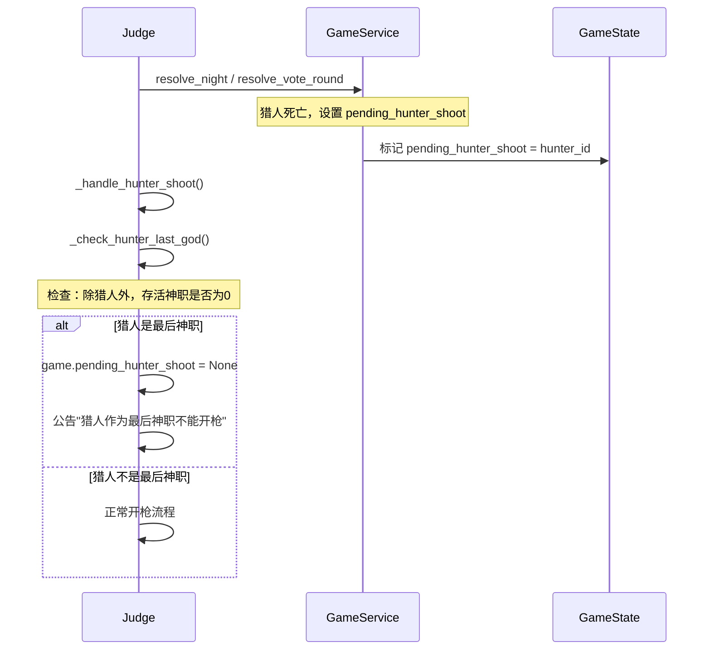
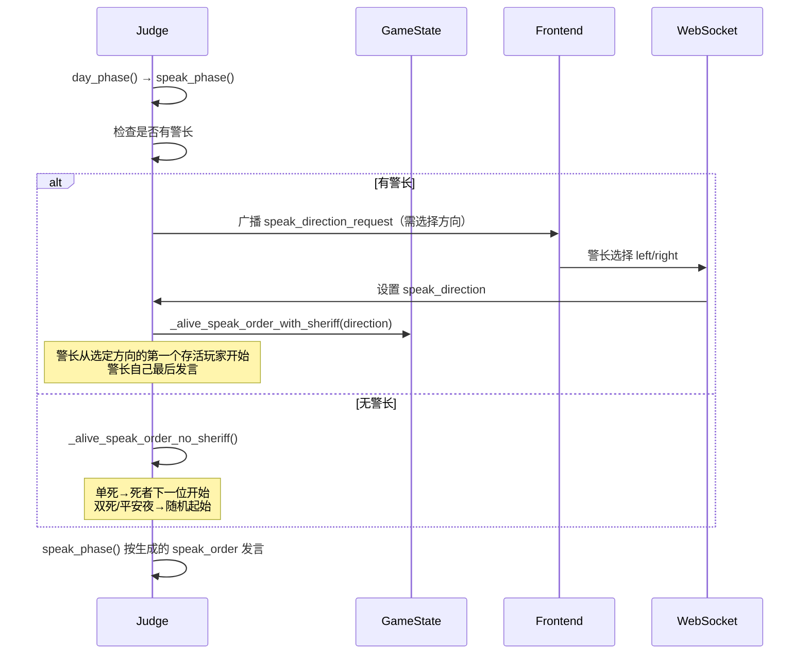
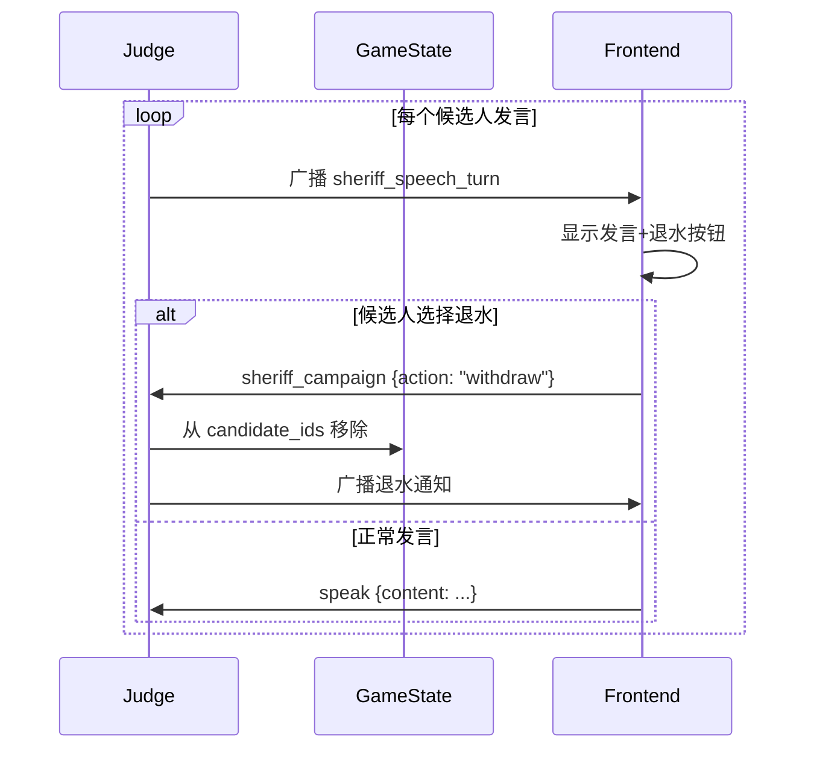
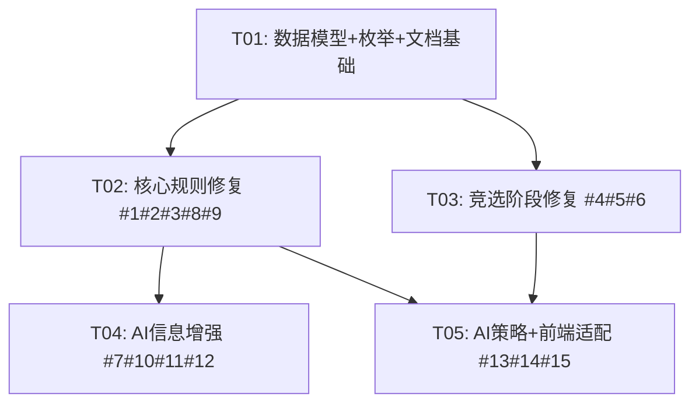

# WolfBot 规则修复架构设计

## Part A: 系统设计

### 1. 实现方案分析

#### 核心技术挑战

1. **猎人最后神职出局不能开枪 (Bug #1)**：需在猎人开枪前动态计算存活神职数量，若猎人是最后神职则禁止开枪，否则开枪会直接触发屠神导致游戏不公正结束。
2. **预言家不能连续验同一人 (Bug #2)**：需扩展 RoleSkill 的 `consecutive_target_allowed` 机制到预言家，并在 Player 中记录上次查验目标，同时在 AI 目标过滤中排除。
3. **白天发言顺序 (Bug #3)**：这是最复杂的修复。当前 `_alive_speak_order` 仅支持 `by_seat` 和 `by_random`。标准规则要求：
   - 有警长 → 警长选择发言方向（左/右），警长最后发言
   - 无警长 → 单死从死者下一位开始，双死/平安夜随机起始
   - 这涉及前端新增警长选方向的交互 UI 和后端发言顺序算法重写
4. **竞选发言退水 (Bug #5)**：需在竞选发言轮次中支持退水操作，前后端联动
5. **AI 决策增强 (Bug #10-15)**：需在 AI prompt 中注入更多游戏状态信息（白痴翻牌、警长身份、发言摘要、投票状态等），同时优化 AI 夜间行动策略

#### 框架与库选择

无需新增第三方库，所有修改均基于现有技术栈：
- 后端：FastAPI + Pydantic + WebSocket（不变）
- 前端：Vue3 + TypeScript + Pinia + Element Plus（不变）

#### 架构模式

保持现有 MVC 分层不变：
- `roles.py` — 角色技能注册表（数据模型 + 规则定义）
- `game_service.py` — 游戏状态管理（纯数据操作，无流程控制）
- `judge_service.py` — 法官流程控制器（流程编排）
- `ai_service.py` — AI 决策服务
- `game_ws.py` — WebSocket 消息处理

---

### 2. 文件列表

```
# 后端
backend/app/domain/roles.py                              # 角色技能注册表
backend/app/domain/enums.py                              # 新增 MessageType 和枚举值
backend/app/schemas/player.py                            # Player 模型扩展
backend/app/services/game_service.py                     # 游戏状态管理
backend/app/services/judge_service.py                     # 法官流程控制器
backend/app/services/ai_service.py                        # AI 决策服务
backend/app/api/websockets/game_ws.py                     # WebSocket 消息处理

# 前端
frontend/src/types/game.ts                               # 类型定义扩展
frontend/src/store/modules/gameStore.ts                   # Pinia 状态管理
frontend/src/components/common/SheriffElection.vue        # 竞选组件（退水支持）
frontend/src/components/game/GamePlay.vue                 # 主游戏页面（警长选方向）

# 文档
mods/12人标准暗牌场(预女猎白).md                          # 规则文档修正
```

---

### 3. 数据结构与接口

```mermaid
classDiagram
    class Player {
        +str id
        +str name
        +int seat_number
        +RoleType role
        +bool is_ai
        +bool is_alive
        +bool night_action_done
        +str|None last_guard_target_id
        +bool vote_immunity_used
        +bool is_sheriff
        +bool antidote_used
        +bool poison_used
        +bool is_spectator
        +str|None avatar_url
        +str|None last_prophet_target_id  ~~新增：预言家上次查验目标~~
        +bool is_idiot_revealed            ~~新增：白痴是否已翻牌（公开可见）~~
    }

    class GameState {
        +str game_id
        +list~Player~ players
        +GameStatus game_status
        +int current_round
        +str|None current_speaker_id
        +bool started
        +str|None winner_faction
        +list~dict~ chats
        +list~dict~ votes
        +list~str~ announcements
        +str owner_player_id
        +str created_at
        +bool ai_cycle_running
        +list~dict~ night_actions
        +list~str~ speak_order
        +bool speak_turn_submitted
        +RoomRuntimeSettings room_settings
        +str|None deadline
        +dict~str,str~ role_selections
        +str game_mode
        +list~dict~ round_events
        +str|None sheriff_id
        +list~str~ sheriff_candidate_ids
        +list~dict~ sheriff_votes
        +bool sheriff_campaign_submitted
        +str|None wolf_self_destructed
        +int sheriff_self_destruct_count
        +str|None pending_hunter_shoot
        +bool hunter_killed_by_poison
        +str room_code
        +str|None speak_direction          ~~新增：发言方向 left/right~~
        +str|None first_dead_player_id      ~~新增：昨夜死亡玩家ID（定发言起点）~~
    }

    class RoleSkill {
        +RoleType role_id
        +str name
        +str faction
        +bool has_night_action
        +str night_action_type
        +str ai_hint
        +str human_hint
        +list~str~ mock_speeches
        +bool can_target_self
        +bool can_target_self_first_night
        +bool consecutive_target_allowed
        +str win_faction_label
    }

    class Judge {
        +str game_id
        +dict _preset_rules
        +BaseGameMode|None _mode
        +_game() GameState
        +_broadcast(msg_type, payload)
        +_announce(content)
        +_send_to_player(player_id, msg_type, payload)
        +_wait_last_words(player_id, player_name, timeout)
        +_handle_hunter_shoot() bool
        +_check_hunter_last_god() bool            ~~新增：检查猎人是否最后神职~~
        +night_phase() bool
        +day_phase() bool
        +speak_phase() bool
        +vote_phase() bool
        +sheriff_election_phase() bool
        +_ask_sheriff_direction() str              ~~新增：询问警长发言方向~~
        +_handle_sheriff_withdraw_during_speech()  ~~新增：竞选发言中退水~~
        +_generate_ai_sheriff_speech(player) str   ~~改造：调用AI API~~
    }

    Player --> GameState : belongs to
    RoleSkill --> Player : defines behavior
    Judge --> GameState : controls
    Judge --> RoleSkill : uses
```



---

### 4. 程序调用流程

#### 4.1 Bug #1：猎人最后神职不能开枪



#### 4.2 Bug #3：白天发言顺序（有警长+警长选方向）



#### 4.3 Bug #5：竞选发言中退水



---

### 5. 待明确事项

1. **Bug #3 警长选方向超时**：如果真人警长超时未选方向，默认选择"左"（顺时针座位递增方向）
2. **Bug #3 AI 警长选方向**：AI 警长需要随机选择方向，但可以根据发言内容做策略（简单起见先随机）
3. **Bug #5 退水后是否还能重新上警**：按标准规则，退水后不能再重新上警。当前 `withdraw_sheriff_campaign` 已限制只能退一次。
4. **Bug #8 文档中"白痴出局无遗言"**：应改为"白痴翻牌免疫不出局，翻牌后不能投票"。白痴不是"出局无遗言"而是"根本不出局"。
5. **Bug #15 猎人被毒杀排除**：当前代码已有 `hunter_killed_by_poison` 标记，但 AI 猎人策略中未使用此信息。需在 AI 猎人 hint 中明确提示。

---

## Part B: 任务分解

### 6. 依赖包

```
无新增依赖。所有修改基于现有技术栈。
```

### 7. 任务列表

---

#### T01: 项目基础设施 + 数据模型扩展

**源文件：**
- `backend/app/schemas/player.py` — 新增 `last_prophet_target_id`、`is_idiot_revealed` 字段
- `backend/app/domain/roles.py` — PROPHET_SKILL 增加 `consecutive_target_allowed=False`；HUNTER_SKILL ai_hint 补充"最后神职不能开枪"规则；所有 ai_hint 补充白痴翻牌和警长信息提示
- `backend/app/domain/enums.py` — 新增 `MessageType.speak_direction_request`
- `backend/app/services/game_service.py` — GameState 新增 `speak_direction`、`first_dead_player_id` 字段；`_snapshot()` 传递 `is_idiot_revealed`；`_check_win_condition` 无需改动（已正确）
- `mods/12人标准暗牌场(预女猎白).md` — Bug #8 文档修正

**修改描述：**

1. `Player` 新增字段：
   - `last_prophet_target_id: str | None = None` — 预言家上次查验目标ID
   - `is_idiot_revealed: bool = False` — 白痴是否已翻牌（公开可见，AI和前端都需要）

2. `PROPHET_SKILL` 修改：`consecutive_target_allowed=False`，与守卫相同的机制

3. `HUNTER_SKILL.ai_hint` 补充：增加"如果你是最后存活的灵牌(神职)，出局时不能开枪，否则会直接触发屠边导致狼人获胜"

4. 所有角色的 `ai_hint` 统一追加公共信息段：
   - 预言家：增加"不能连续两晚查验同一人"
   - 所有角色：增加"注意观察哪些玩家是已翻牌的白痴（不能投票），以及当前警长是谁"

5. `GameState` 新增字段：
   - `speak_direction: str | None = None` — 发言方向（left/right），由警长选择
   - `first_dead_player_id: str | None = None` — 昨夜死亡玩家ID（用于确定发言起点）

6. `_snapshot()` 方法扩展：在 safe_players 中传递 `is_idiot_revealed`

7. `MessageType` 新增：`speak_direction_request = "speak_direction_request"` — 警长选方向请求

8. `mods/12人标准暗牌场(预女猎白).md`：将"白痴出局无遗言"改为"白痴被投票放逐时翻牌免疫不出局，之后可发言但不能投票"

**依赖：** 无
**优先级：** P0

---

#### T02: 核心规则修复（Bug #1 猎人最后神职 + Bug #2 预言家连验 + Bug #3 发言顺序 + Bug #8/#9）

**源文件：**
- `backend/app/services/game_service.py` — `_alive_speak_order` 重写、`resolve_night` 中记录 `first_dead_player_id`、`record_night_action` 预言家连验校验、`resolve_vote_round` 白痴翻牌标记
- `backend/app/services/judge_service.py` — `_handle_hunter_shoot` 增加最后神职检查、`speak_phase` 支持警长选方向、新增 `_ask_sheriff_direction` 方法、`_alive_speak_order_with_sheriff` 和 `_alive_speak_order_no_sheriff`
- `backend/app/api/websockets/game_ws.py` — Bug #9 猎人开枪后增加胜负检查、新增 `speak_direction` 消息处理

**修改描述：**

**Bug #1 — 猎人最后神职不能开枪：**

1. `judge_service.py` → `_handle_hunter_shoot()`：
   - 在方法开头，猎人开枪前，调用 `_check_hunter_last_gog()` 
   - 新方法 `_check_hunter_last_god()`：获取存活神职列表（排除猎人自己，因为猎人已死），如果为空则返回 True
   - 如果是最后神职：公告"猎人是最后存活的灵牌(神职)，不能开枪"，`game.pending_hunter_shoot = None`，return True
   - 此逻辑适用于 `resolve_night` 后和 `resolve_vote_round` 后的两次 `_handle_hunter_shoot` 调用

**Bug #2 — 预言家不能连续验同一人：**

1. `roles.py` → PROPHET_SKILL：`consecutive_target_allowed=False`（已在T01完成）

2. `game_service.py` → `record_night_action()`：
   - 在现有 `consecutive_target_allowed` 检查逻辑中，当前只检查了 `player.last_guard_target_id`
   - 修改为通用逻辑：对于 `consecutive_target_allowed=False` 的角色，使用对应的 last_target_id 字段
   - 预言家使用 `player.last_prophet_target_id`，守卫使用 `player.last_guard_target_id`
   - 报错信息动态生成：`f"{skill.name}不能连续两晚选择同一目标"`

3. `game_service.py` → `resolve_night()`：
   - 在记录守卫 last_guard_target_id 的位置，增加记录预言家 last_prophet_target_id
   - 遍历 night_actions 中 role=prophet 的记录，将 targetId 写入 player.last_prophet_target_id

4. `ai_service.py` → `_generate_ai_night_action()`：
   - 在预言家分支（`skill.night_action_type == "check"`），过滤掉 `player.last_prophet_target_id` 对应的目标
   - 当前代码已对守卫做了 `consecutive_target_allowed` 过滤，扩展为对预言家也过滤

**Bug #3 — 白天发言顺序：**

1. `game_service.py` → `_alive_speak_order()` 重写：
   ```python
   def _alive_speak_order(game, speak_order_rule="by_seat", 
                          sheriff_id=None, first_dead_player_id=None,
                          speak_direction=None):
       alive = [p for p in game.players if p.is_alive and not p.vote_immunity_used]  
       # 注意：已翻牌白痴仍在存活列表，只是不能投票
       
       if speak_order_rule == "by_random":
           random.shuffle(alive)
           return [p.id for p in alive]
       
       alive.sort(key=lambda p: p.seat_number)
       
       if sheriff_id:
           # 有警长：警长定方向，警长最后发言
           sheriff = next((p for p in alive if p.id == sheriff_id), None)
           if not sheriff:
               return [p.id for p in alive]
           
           # 按方向确定起始位置
           direction = speak_direction or "right"  # 默认顺时针
           
           # 从警长旁边开始，警长最后
           non_sheriff = [p for p in alive if p.id != sheriff_id]
           if direction == "right":
               # 顺时针：从警长座位号下一个开始
               start_idx = 0
               for i, p in enumerate(non_sheriff):
                   if p.seat_number > sheriff.seat_number:
                       start_idx = i
                       break
               ordered = non_sheriff[start_idx:] + non_sheriff[:start_idx]
           else:
               # 逆时针：从警长座位号上一个开始
               start_idx = len(non_sheriff) - 1
               for i in range(len(non_sheriff) - 1, -1, -1):
                   if non_sheriff[i].seat_number < sheriff.seat_number:
                       start_idx = i
                       break
               ordered = non_sheriff[start_idx:] + non_sheriff[:start_idx]
               ordered.reverse()
           
           ordered.append(sheriff)  # 警长最后发言
           return [p.id for p in ordered]
       else:
           # 无警长：单死从死者下一位开始
           if first_dead_player_id:
               dead = next((p for p in game.players if p.id == first_dead_player_id), None)
               if dead:
                   # 从死者下一位开始
                   start_idx = 0
                   for i, p in enumerate(alive):
                       if p.seat_number > dead.seat_number:
                           start_idx = i
                           break
                   alive = alive[start_idx:] + alive[:start_idx]
           else:
               # 双死/平安夜：随机起始
               start = random.randint(0, len(alive) - 1) if alive else 0
               alive = alive[start:] + alive[:start]
           return [p.id for p in alive]
   ```

2. `judge_service.py` → `speak_phase()` 修改：
   - 在 `begin_speak_turn` 前判断是否有警长
   - 有警长且是真人：广播 `speak_direction_request`，等待选择
   - 有警长且是AI：随机选择方向
   - 无警长：传入 `first_dead_player_id`
   - 调用 `begin_speak_turn` 时传入新参数

3. `judge_service.py` → 新增 `_ask_sheriff_direction()` 方法：
   - 广播 `speak_direction_request` 给警长玩家
   - 等待 15 秒，超时默认 "right"
   - AI 警长随机选择

4. `game_ws.py` → 新增 `speak_direction` 消息处理：
   - 收到 `speak_direction` 消息后，设置 `game.speak_direction`
   - 只有当前警长可以发送此消息

**Bug #8 — 白痴翻牌文档修正：**（在T01中已完成文档修改）

**Bug #9 — 猎人开枪WebSocket端缺少胜负检查：**

1. `game_ws.py` → `hunter_shoot` 消息处理：
   - 在 `target.is_alive = False` 之后，增加 `_check_win_condition` 调用
   - 如果返回非 None（游戏结束），广播 `game_over` 消息
   - 同时检查被枪杀玩家是否是警长，若是则触发 `_handle_sheriff_death`

2. `game_service.py` → `resolve_vote_round()`：
   - 白痴翻牌时标记 `eliminated_player.is_idiot_revealed = True`

**依赖：** T01
**优先级：** P0

---

#### T03: 竞选阶段修复（Bug #4 发言顺序 + Bug #5 退水 + Bug #6 AI竞选发言）

**源文件：**
- `backend/app/services/judge_service.py` — `sheriff_election_phase` 中发言顺序修改、竞选发言循环中退水支持、`_generate_ai_sheriff_speech` 改为调用 AI API
- `backend/app/api/websockets/game_ws.py` — 支持竞选发言中退水消息
- `frontend/src/components/common/SheriffElection.vue` — 竞选发言中显示退水按钮
- `frontend/src/store/modules/gameStore.ts` — 新增退水状态管理

**修改描述：**

**Bug #4 — 竞选发言顺序按上警顺序逆序：**

1. `judge_service.py` → `sheriff_election_phase()`：
   - 当前代码 L781-785：
     ```python
     candidates_sorted = sorted(
         candidates,
         key=lambda cid: next((p.seat_number for p in game.players if p.id == cid), 0),
         reverse=True,
     )
     ```
   - 修改为：
     ```python
     # 按上警顺序逆序：最后一个上警的先发言
     candidates_sorted = list(reversed(game.sheriff_candidate_ids))
     ```
   - `sheriff_candidate_ids` 是按上警时间追加的列表，逆序即为"最后上警的先发言"

**Bug #5 — 竞选发言中退水：**

1. `judge_service.py` → `sheriff_election_phase()` 竞选发言循环：
   - 在每个候选人发言前，检查是否退水（已有 `if candidate_id not in game.sheriff_candidate_ids: continue`）
   - 增加逻辑：在真人候选人发言等待期间，也检查退水操作
   - 在 `sheriff_speech_turn` 广播中增加 `canWithdraw: true` 字段

2. `game_ws.py` → `sheriff_campaign` 消息处理：
   - 当前只在 `sheriff_election` 状态下允许上警/退水
   - 需要确认：竞选发言阶段（`sheriff_speech_turn` 期间），退水操作是否被允许
   - 当前 `withdraw_sheriff_campaign` 只校验了 `game_status == sheriff_election`，发言阶段也在此状态中，所以退水应该已支持
   - 但前端 SheriffElection.vue 在 `speech` 阶段不显示退水按钮，需要前端修改

3. `SheriffElection.vue`：
   - 在 `speech` 阶段，如果当前用户是候选人（`isCandidate`），显示退水按钮
   - 退水后从候选列表移除

**Bug #6 — AI竞选发言调用AI API：**

1. `judge_service.py` → `_generate_ai_sheriff_speech()`：
   - 当前只是随机模板，改为调用 `ai_service._generate_ai_speech` 或构建专用 prompt
   - 新增参数 `is_campaign=True`，在 prompt 中强调这是竞选发言
   - 如果 AI API 可用，调用 API；否则回退到模板
   - 实现方案：直接调用 `_generate_ai_speech(game_id, player_id)` 并在 AI 提示中加入竞选上下文
   - 更简洁的方案：在 `_generate_ai_speech` 的 prompt 中，检查当前 `game_status` 是否为 `sheriff_election`，如果是则加入竞选提示

2. `ai_service.py` → `_generate_ai_speech()`：
   - 在构建 messages 时，检查 `game.game_status == GameStatus.sheriff_election`
   - 如果是竞选发言，在 system prompt 中加入："你正在竞选警长，请说明为什么你适合当警长，展示你的领导力。"
   - 去除 `judge_service._generate_ai_sheriff_speech` 方法，统一使用 `_generate_ai_speech`

**依赖：** T01
**优先级：** P1

---

#### T04: AI信息增强与投票改进（Bug #7 AI投票信息 + Bug #10-12 AI上下文缺失）

**源文件：**
- `backend/app/services/ai_service.py` — `_generate_ai_speech` 补充白痴翻牌/警长信息、`_generate_ai_vote` 补充发言摘要和投票状态、`_generate_ai_night_action` 预言家/守卫策略增强
- `backend/app/services/game_service.py` — `_alive_speak_order` / `begin_speak_turn` 适配

**修改描述：**

**Bug #7 — AI投票看不到谁投了谁：**

1. `ai_service.py` → `_generate_ai_vote()`：
   - 在构建投票 prompt 时，注入当前投票状态信息
   - 新增"本轮发言摘要"：从 `game.chats` 中取本轮发言（按轮次过滤）
   - 新增"当前投票情况"：从 `game.votes` 中取已投票信息（谁投了谁）
   - 在 user message 中增加：
     ```
     本轮发言摘要：
     - 3号：我觉得5号很可疑...
     - 5号：我是好人，3号在带节奏...
     
     当前投票情况：
     - 2号投了5号
     - 7号投了3号
     ```

**Bug #10 — AI不知道白痴已翻牌：**

1. `ai_service.py` → `_generate_ai_speech()` 和 `_generate_ai_vote()`：
   - 在构建游戏上下文时，新增"已翻牌白痴"信息
   - 从 `game.players` 中筛选 `is_idiot_revealed == True` 的玩家
   - 在 alive_info 附近增加：
     ```python
     idiot_revealed = [f"{p.seat_number}号" for p in game.players if p.is_idiot_revealed]
     idiot_info = f"\n已翻牌白痴（不能投票）：{'、'.join(idiot_revealed)}" if idiot_revealed else ""
     ```

**Bug #11 — AI不知道谁有警徽：**

1. `ai_service.py` → `_generate_ai_speech()` 和 `_generate_ai_vote()`：
   - 在构建游戏上下文时，新增警长信息
   - 如果有警长，增加：
     ```python
     if game.sheriff_id:
         sheriff_p = next((p for p in game.players if p.id == game.sheriff_id), None)
         if sheriff_p:
             sheriff_info = f"\n当前警长：{sheriff_p.seat_number}号（拥有1.5票投票权，最后发言）"
     ```

**Bug #12 — AI竞选发言没调用API：**（在T03中已处理）

**依赖：** T01, T02
**优先级：** P1

---

#### T05: AI策略增强 + 文档修正（Bug #13-15 + 前端适配）

**源文件：**
- `backend/app/services/ai_service.py` — `_generate_ai_night_action` 预言家/守卫/猎人策略增强
- `frontend/src/components/game/GamePlay.vue` — 发言方向选择UI
- `frontend/src/store/modules/gameStore.ts` — speak_direction 状态管理
- `frontend/src/types/game.ts` — 新增类型定义

**修改描述：**

**Bug #13 — AI预言家决策太随机：**

1. `ai_service.py` → `_generate_ai_night_action()` 预言家分支：
   - 当前：`return random.choice(targets).id, ""`
   - 改为策略性选择：
     ```python
     if player.role == RoleType.prophet:
         # 优先验：发言可疑的人（从记忆中获取被怀疑对象）
         # 其次验：从未验过的人
         # 排除：上次验过的人（已在 targets 过滤中处理）
         
         # 策略1：从压缩记忆中获取可疑玩家
         suspicious = _get_suspicious_players(store, targets)
         if suspicious:
             return random.choice(suspicious).id, ""
         
         # 策略2：优先验未验过的存活玩家
         unchecked = [p for p in targets if p.id != player.last_prophet_target_id]
         if unchecked:
             return random.choice(unchecked).id, ""
         
         return random.choice(targets).id, ""
     ```
   - 新增辅助函数 `_get_suspicious_players(store, candidates)`：从记忆的指控链中提取被怀疑玩家

**Bug #14 — AI守卫决策太随机：**

1. `ai_service.py` → `_generate_ai_night_action()` 守卫分支：
   - 当前：`return random.choice(targets).id, ""`
   - 改为策略性选择：
     ```python
     if player.role == RoleType.guard:
         # 优先守：预言家/警长等关键角色
         # 其次守：上次被袭击但被救的玩家
         # 排除：上次守过的人（已在 targets 过滤中处理）
         
         # 策略1：守护关键角色（预言家 > 警长 > 女巫）
         key_roles = [p for p in targets 
                      if p.role in (RoleType.prophet,) or p.id == game.sheriff_id]
         if key_roles and random.random() < 0.6:
             return random.choice(key_roles).id, ""
         
         # 策略2：随机守护（已排除连守）
         return random.choice(targets).id, ""
     ```
   - 注意：守卫不知道谁是预言家（暗牌场），所以需要从记忆/发言中推断
   - 简化版：守卫倾向守护警长（如果知道的话），因为警长是公开信息

**Bug #15 — AI猎人开枪排除毒杀：**

1. `judge_service.py` → `_handle_hunter_shoot()` AI 猎人部分：
   - 当前代码已排除毒杀（通过 `hunter_killed_by_poison` 标记），AI 不会在毒杀时触发开枪
   - 但 AI 猎人选择目标时，应排除可能是被毒杀的情况（在自身被毒杀时不开枪的逻辑已在 resolve_night 中处理）
   - 此 Bug 实际上已在现有代码中修复（通过 `hunter_killed_by_poison` 检查），只需在 AI hint 中明确说明

2. `roles.py` → HUNTER_SKILL.ai_hint：
   - 在T01中已更新提示词

**前端适配（Bug #3 发言方向UI）：**

1. `GamePlay.vue`：
   - 新增"警长选择发言方向"提示区域
   - 当收到 `speak_direction_request` 消息时，如果当前用户是警长，显示选择按钮（左/右）
   - 选择后通过 WebSocket 发送 `speak_direction` 消息

2. `gameStore.ts`：
   - 新增 `speakDirection: string | null` 状态
   - 新增 `speakDirectionRequest: boolean` 状态（是否需要选方向）

3. `game.ts` 类型定义：
   - 新增 `SpeakDirectionRequest` 类型
   - `Player` 类型新增 `isIdiotRevealed`、`lastProphetTargetId` 字段

**依赖：** T01, T02
**优先级：** P2

---

### 8. 共享知识

```
- 所有夜间行动校验使用 SKILL_REGISTRY[player.role].consecutive_target_allowed 字段
- 预言家使用 player.last_prophet_target_id 记录上次查验目标（与守卫 last_guard_target_id 对称）
- 白痴翻牌后 is_idiot_revealed=True 标记为公开信息（所有人可见），vote_immunity_used=True 标记不能投票
- 发言方向：speak_direction="right" 表示顺时针（座位号递增），"left" 表示逆时针（座位号递减）
- 警长选择发言方向超时默认 "right"
- 竞选发言顺序按 sheriff_candidate_ids 列表逆序（最后上警的先发言）
- 猎人最后神职不能开枪：检查存活神职数量时排除猎人自己
- WebSocket 消息新增类型：speak_direction_request / speak_direction
- AI 上下文信息增强：所有 AI 发言/投票 prompt 需包含白痴翻牌状态、警长信息
- 前端发言方向选择：仅警长玩家可见和操作，非警长玩家只看到提示"警长正在选择发言方向"
```

### 9. 任务依赖图



### 10. Bug 与任务映射

| Bug | 任务 | 说明 |
|-----|------|------|
| #1 猎人最后神职不能开枪 | T02 | judge_service._handle_hunter_shoot 添加检查 |
| #2 预言家不能连续验同一人 | T01+T02 | T01 模型+注册表, T02 校验逻辑 |
| #3 白天发言顺序 | T02+T05 | T02 后端算法, T05 前端UI |
| #4 竞选发言顺序 | T03 | 按 candidate_ids 逆序 |
| #5 竞选发言退水 | T03 | 前后端联动 |
| #6 AI竞选发言调API | T03 | 统一用 _generate_ai_speech |
| #7 AI投票看不到投票 | T04 | prompt 注入投票状态 |
| #8 白痴文档修正 | T01 | 文档修改 |
| #9 猎人开枪胜负检查 | T02 | game_ws 添加检查 |
| #10 AI不知道白痴翻牌 | T04 | prompt 注入翻牌信息 |
| #11 AI不知道警长 | T04 | prompt 注入警长信息 |
| #12 AI竞选发言调API | T03 | 与 #6 合并处理 |
| #13 AI预言家策略 | T05 | 策略优先级选择 |
| #14 AI守卫策略 | T05 | 优先守关键角色 |
| #15 AI猎人毒杀排除 | T01+T05 | T01 更新hint, T05 补充策略 |
