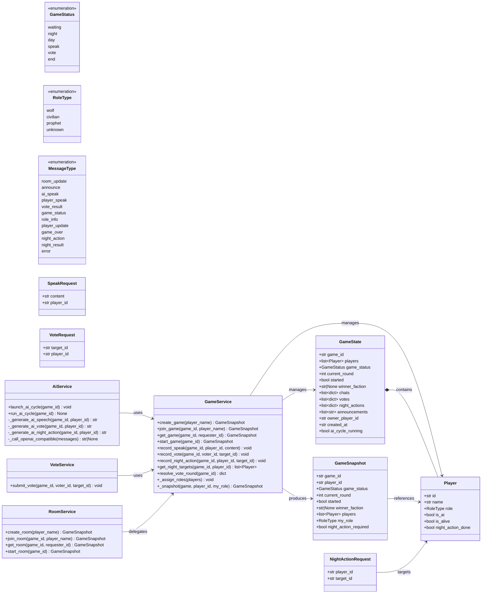
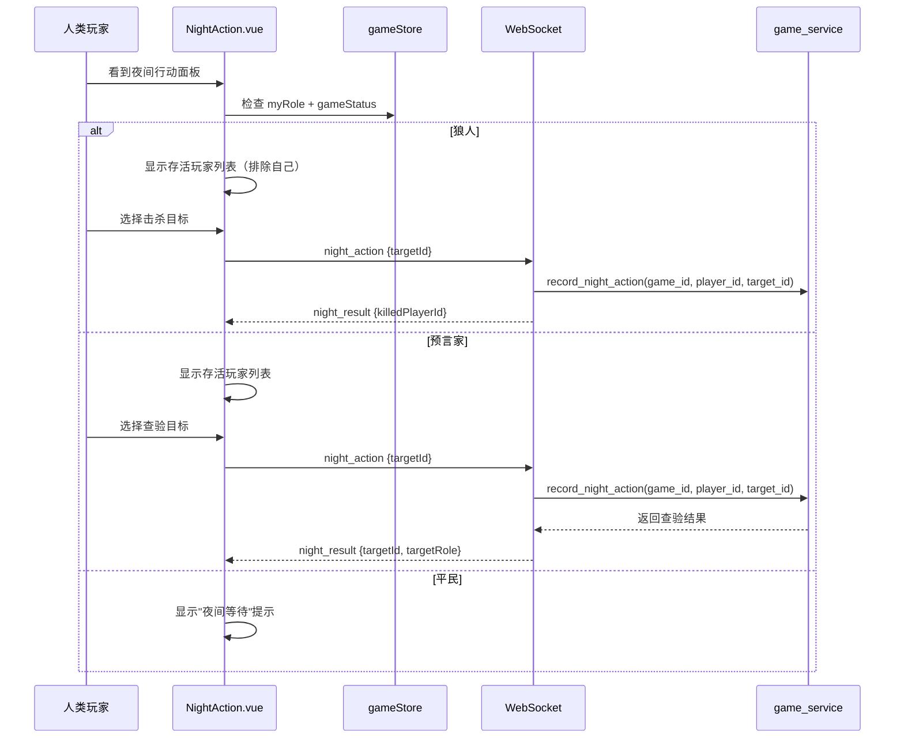
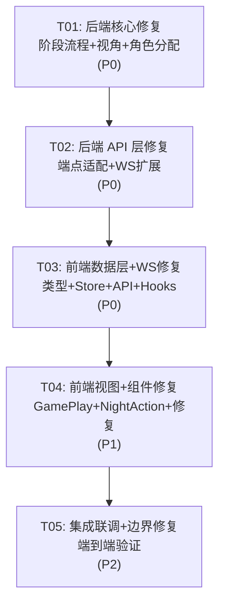

# AI 狼人杀（WolfBot）修复架构设计方案

## Part A: 系统设计

---

### 1. 实现方案与框架选型

#### 1.1 核心技术挑战

| 挑战 | 说明 | 解决策略 |
|------|------|----------|
| 夜间阶段流程缺失 | `GameStatus.night/day` 已定义但从未使用，AI 循环直接 speak→vote | 在 `ai_service.run_ai_cycle()` 中插入完整的 night→day 阶段，AI 狼人/预言家自动行动，人类玩家通过 WebSocket 提交夜间行动 |
| 人类发言窗口缺失 | AI speak 阶段不等待人类输入，直接进入投票 | 引入 `speak_window_seconds` 配置项，在 speak 阶段给人类留出发言时间窗口 |
| 视角泄露 | `get_game()` 总返回房主视角，AI 投票提示暴露所有人角色 | `get_game()` 接收 `requester_id` 参数；`_generate_ai_vote()` 对非自身角色返回 `unknown` |
| 前端 WebSocket 断连 | GamePlay 页面没有建立 WebSocket 连接 | 在 GamePlay 中复用 `useGameSocket` hook，建立持久连接 |
| 夜间行动 UI 缺失 | 前端没有狼人击杀/预言家查验的操作界面 | 新增 `NightAction.vue` 组件，根据角色显示不同操作面板 |

#### 1.2 框架与库选型（沿用现有技术栈）

| 层 | 框架/库 | 理由 |
|----|---------|------|
| 后端 Web | FastAPI | 已有，支持 async + WebSocket |
| 数据校验 | Pydantic v2 | 已有，BaseSchema 基类统一 camelCase 序列化 |
| 状态存储 | 纯内存 `_GAMES` dict | 已有，无 DB 依赖 |
| AI 调用 | httpx AsyncClient | 已有，OpenAI 兼容 API |
| 前端框架 | Vue3 + TypeScript | 已有 |
| 状态管理 | Pinia | 已有 |
| UI 组件库 | Element Plus | 已有 |
| HTTP 客户端 | Axios | 已有 |
| 实时通信 | 原生 WebSocket | 已有，通过 `useGameSocket` hook 封装 |

**不引入新依赖**，所有修复在现有技术栈内完成。

#### 1.3 架构模式

沿用现有的**分层架构**：
- **Domain 层**（enums）：定义游戏状态、角色类型等枚举
- **Schema 层**（schemas）：Pydantic 模型，API 请求/响应结构
- **Service 层**（services）：业务逻辑，GameState 管理
- **API 层**（api/routers + api/websockets）：HTTP REST + WebSocket 端点
- **WebSocket 层**（websocket）：连接管理与广播

---

### 2. 文件列表

#### 后端文件（修改/新增）

| 文件路径 | 操作 | 说明 |
|----------|------|------|
| `app/domain/enums.py` | 修改 | 新增 `MessageType.night_action`、`MessageType.night_result`、`RoleType.witch`（预留，本期不实现） |
| `app/schemas/game.py` | 修改 | 新增 `NightActionRequest` schema；`GameSnapshot` 增加 `night_action_required: bool` 字段 |
| `app/schemas/player.py` | 修改 | `Player` 增加 `night_action_done: bool` 临时字段 |
| `app/schemas/socket.py` | 无变更 | — |
| `app/services/game_service.py` | 修改 | 核心修改：`get_game()` 接受 `requester_id`；`_assign_roles()` 动态分配；新增 `record_night_action()`、`get_night_targets()`；`start_game()` 初始状态改为 night |
| `app/services/ai_service.py` | 修改 | 核心修改：`run_ai_cycle()` 完整 night→day→speak→vote 流程；`_generate_ai_vote()` 遮蔽角色；新增 `_generate_ai_night_action()`；新增 `ai_speak_window_seconds` |
| `app/services/vote_service.py` | 修改 | 修复 `submit_vote()` 参数签名 |
| `app/services/room_service.py` | 修改 | `start_room()` 调用 `launch_ai_cycle()` |
| `app/services/result_service.py` | 无变更 | — |
| `app/api/routers/games.py` | 修改 | `get_game_route` 接收 `playerId` query param；新增 `/action/night` 端点 |
| `app/api/routers/rooms.py` | 修改 | `get_room_route` 接收 `playerId` query param |
| `app/api/websockets/game_ws.py` | 修改 | 新增 `night_action` 消息类型处理；修复 `get_game()` 调用传入 player_id |
| `app/core/config.py` | 修改 | 新增 `ai_speak_window_seconds` 配置项 |
| `app/utils/ids.py` | 无变更 | — |
| `app/utils/time.py` | 无变更 | — |
| `app/utils/validate.py` | 无变更 | — |
| `app/websocket/manager.py` | 无变更 | — |
| `app/websocket/broadcaster.py` | 无变更 | — |

#### 前端文件（修改/新增）

| 文件路径 | 操作 | 说明 |
|----------|------|------|
| `src/types/game.ts` | 修改 | 新增 `NightActionPayload` 类型；`SocketMessage.type` 增加 `night_action`、`night_result` |
| `src/store/modules/gameStore.ts` | 修改 | 新增 `nightActionRequired`、`nightResult` 状态；新增 `setNightActionRequired`、`setNightResult` actions |
| `src/api/gameApi.ts` | 修改 | `getGame` 传入 playerId；新增 `submitNightAction` API；`submitSpeak`/`submitVote` 修复参数传递 |
| `src/hooks/useGameSocket.ts` | 修改 | 新增 `night_action`、`night_result` 消息处理 |
| `src/hooks/useGameLogic.ts` | 修改 | 激活死代码：导出 `canPlayerSpeak`/`canPlayerVote`/`canNightAction` 供组件使用 |
| `src/views/GamePlay.vue` | 修改 | 建立 WebSocket 连接；传入 playerId；传入 :round；集成 NightAction 组件；按阶段禁用操作面板 |
| `src/views/GameResult.vue` | 修改 | `goHome` 调用 `store.resetGame()` |
| `src/views/GameRoom.vue` | 微调 | 无重大修改 |
| `src/views/HomeView.vue` | 无变更 | — |
| `src/components/common/ChatBox.vue` | 修改 | 新增 `disabled` prop；提交后清空 draft |
| `src/components/common/VotePanel.vue` | 修改 | 新增 `disabled` prop；排除自己；提交后清空 selected |
| `src/components/common/NightAction.vue` | **新增** | 夜间行动面板：狼人选择击杀目标、预言家查验身份 |
| `src/components/game/GameStatus.vue` | 无变更 | — |
| `src/components/game/PlayerList.vue` | 无变更 | — |
| `src/components/common/RoleCard.vue` | 无变更 | — |
| `src/components/common/Announce.vue` | 无变更 | — |
| `src/utils/constants.ts` | 修改 | 更新标签映射 |
| `src/utils/validate.ts` | 修改 | 新增 `canNightAction()` 函数 |
| `src/router/index.ts` | 修改 | `getGame` 调用传入 playerId |

---

### 3. 数据结构与接口



---

### 4. 程序调用流程

#### 4.1 完整游戏循环（night→day→speak→vote）

```mermaid
sequenceDiagram
    participant Client as 前端
    participant WS as WebSocket
    participant AISvc as ai_service
    participant GSvc as game_service
    participant Bcast as broadcaster

    Note over Client,Bcast: ===== 游戏开始 =====
    Client->>WS: start
    WS->>GSvc: start_game(game_id)
    GSvc.>GSvc: _assign_roles(players) 动态分配
    GSvc-->>GSvc: game_status = night
    WS->>Client: role_info {role}
    WS->>Bcast: game_status {status: night}

    Note over Client,Bcast: ===== 夜间阶段 =====
    AISvc->>GSvc: set_game_status(night)
    AISvc->>Bcast: game_status {status: night, currentRound}

    loop 每个AI狼人
        AISvc->>AISvc: _generate_ai_night_action(game_id, ai_wolf_id)
        AISvc->>GSvc: record_night_action(game_id, ai_wolf_id, target_id)
    end

    loop 每个AI预言家
        AISvc->>AISvc: _generate_ai_night_action(game_id, ai_prophet_id)
        AISvc->>GSvc: record_night_action(game_id, ai_prophet_id, target_id)
    end

    AISvc->>Bcast: night_action {actionRequired: true}
    Note over Client: 人类玩家看到夜间行动面板

    Client->>WS: night_action {targetId}
    WS->>GSvc: record_night_action(game_id, player_id, target_id)

    AISvc->>AISvc: await sleep(ai_speak_window_seconds)
    AISvc->>GSvc: resolve_night(game_id)
    GSvc.>GSvc: 处理夜间结果，标记死亡
    AISvc->>Bcast: night_result {killedPlayerId, ...}
    AISvc->>Bcast: player_update {playerId, isAlive: false}

    alt 游戏结束检查
        AISvc->>Bcast: game_over
    end

    Note over Client,Bcast: ===== 白天阶段 =====
    AISvc->>GSvc: set_game_status(day)
    AISvc->>Bcast: game_status {status: day, currentRound}

    Note over Client,Bcast: ===== 发言阶段 =====
    AISvc->>GSvc: set_game_status(speak)
    AISvc->>Bcast: game_status {status: speak}

    loop 每个AI玩家
        AISvc->>AISvc: _generate_ai_speech(game_id, ai_player_id)
        AISvc->>GSvc: record_speak(game_id, ai_player_id, speech)
        AISvc->>Bcast: ai_speak {content, playerId, playerName}
    end

    Note over Client: 人类发言窗口开启
    Client->>WS: speak {content}
    WS->>GSvc: record_speak(game_id, player_id, content)
    WS->>Bcast: player_speak {content, playerId, playerName}

    AISvc->>AISvc: await sleep(ai_speak_window_seconds)

    Note over Client,Bcast: ===== 投票阶段 =====
    AISvc->>GSvc: set_game_status(vote)
    AISvc->>Bcast: game_status {status: vote}

    loop 每个AI玩家
        AISvc->>AISvc: _generate_ai_vote(game_id, ai_player_id) 角色遮蔽
        AISvc->>GSvc: record_vote(game_id, ai_player_id, target_id)
        AISvc->>Bcast: vote_result {voterId, targetId}
    end

    Note over Client: 人类投票窗口开启
    Client->>WS: vote {targetId}
    WS->>GSvc: record_vote(game_id, player_id, target_id)
    WS->>Bcast: vote_result {voterId, targetId}

    AISvc->>AISvc: await sleep(ai_vote_window_seconds)
    AISvc->>GSvc: resolve_vote_round(game_id)

    alt 游戏结束
        AISvc->>Bcast: game_over
    else 继续下一轮
        AISvc->>GSvc: clear_votes(game_id)
        Note over AISvc: 回到夜间阶段
    end
```

#### 4.2 人类玩家夜间行动流程



---

### 5. 不明确之处与假设

| 编号 | 不明确之处 | 假设/处理方式 |
|------|-----------|---------------|
| U1 | 女巫角色是否本期实现 | 本期不实现，仅 wolf/prophet/civilian，预留 RoleType.witch |
| U2 | 多人类玩家同时发言冲突 | 假设单人类玩家场景，多人类场景待后续支持 |
| U3 | 夜间狼人击杀优先级 vs 预言家查验顺序 | 假设先处理预言家查验（仅获取信息），再处理狼人击杀（实际死亡） |
| U4 | 夜间人类超时未行动 | 假设超时后跳过该人类行动，不影响 AI 行动结算 |
| U5 | `resolve_vote_round()` 在平票时的处理 | 沿用现有逻辑：平票取 max 中的第一个，不特别处理 |
| U6 | 多个人类玩家加入时的角色分配 | `_assign_roles()` 动态分配，按人类+AI 总人数计算角色配比 |

---

## Part B: 任务分解

---

### 6. 依赖包列表

```
# 后端（无需新增，沿用现有）
fastapi>=0.110.0        # Web 框架
uvicorn>=0.29.0         # ASGI 服务器
pydantic>=2.0.0         # 数据校验
httpx>=0.27.0           # HTTP 客户端（AI API 调用）

# 前端（无需新增，沿用现有）
vue@^3.4.0              # UI 框架
typescript@^5.0.0       # 类型系统
pinia@^2.1.0            # 状态管理
element-plus@^2.6.0     # 组件库
axios@^1.6.0            # HTTP 客户端
vue-router@^4.3.0       # 路由
```

---

### 7. 任务列表（按依赖顺序）

#### T01: 后端核心修复 — 阶段流程 + 视角修复 + 角色分配

**源文件**：
- `app/domain/enums.py`
- `app/core/config.py`
- `app/schemas/game.py`
- `app/schemas/player.py`
- `app/services/game_service.py`
- `app/services/ai_service.py`
- `app/services/vote_service.py`
- `app/services/room_service.py`

**依赖**：无

**优先级**：P0

**详细说明**：
1. **enums.py**：新增 `MessageType.night_action` 和 `MessageType.night_result`
2. **config.py**：新增 `ai_speak_window_seconds` 配置（默认 8 秒）
3. **schemas/game.py**：
   - `GameSnapshot` 新增 `night_action_required: bool = False`
   - 新增 `NightActionRequest(BaseSchema)`，含 `player_id`、`target_id`
4. **schemas/player.py**：`Player` 新增 `night_action_done: bool = False`
5. **game_service.py**（核心修改）：
   - `get_game(game_id, requester_id=None)` — 接受 requester_id，用 `_snapshot(game, requester_id, my_role)` 返回正确视角
   - `_assign_roles(players)` — 根据玩家总数动态分配：`n_wolves = max(1, total // 4)`，`n_prophets = 1`，其余 civilian
   - `start_game()` — 初始状态改为 `GameStatus.night` 而非 `GameStatus.speak`
   - 新增 `record_night_action(game_id, player_id, target_id)` — 记录夜间行动
   - 新增 `get_night_targets(game_id, player_id)` — 返回当前玩家可行动的存活目标列表
   - 新增 `resolve_night(game_id)` — 结算夜间行动：处理预言家查验结果、处理狼人击杀、重置 `night_action_done`、检查胜负
   - `GameState` 新增 `night_actions: list[dict]` 字段
   - `_snapshot()` 根据 `requester_id` 和当前状态设置 `night_action_required`
6. **ai_service.py**（核心修改）：
   - `run_ai_cycle()` 改为完整的 **night→day→speak→vote** 循环
   - 夜间阶段：AI 狼人自动选择击杀目标，AI 预言家自动查验
   - speak 阶段：AI 发言后 `await asyncio.sleep(ai_speak_window_seconds)` 等待人类发言
   - `_generate_ai_vote()` 修复角色泄露：候选人的 role 对 AI 隐藏，设为 `unknown`
   - 新增 `_generate_ai_night_action(game_id, player_id)` — AI 狼人/预言家的夜间行动生成
7. **vote_service.py**：修复 `submit_vote(game_id, voter_id, target_id)` 签名，正确传入3个参数
8. **room_service.py**：`start_room()` 调用 `launch_ai_cycle(game_id)`；`get_room()` 传入 `requester_id`

---

#### T02: 后端 API 层修复 — 端点适配 + WebSocket 消息扩展

**源文件**：
- `app/api/routers/games.py`
- `app/api/routers/rooms.py`
- `app/api/websockets/game_ws.py`

**依赖**：T01

**优先级**：P0

**详细说明**：
1. **games.py**：
   - `get_game_route(game_id, playerId: str | None = None)` — 接收 playerId query param，传给 `get_game(game_id, requester_id=playerId)`
   - 新增 `POST /{game_id}/action/night` 端点，接收 `NightActionRequest`，调用 `game_service.record_night_action()`
2. **rooms.py**：
   - `get_room_route(game_id, playerId: str | None = None)` — 接收 playerId，传给 `get_room(game_id, requester_id=playerId)`
   - `start_room_route(game_id)` — 调用 `room_service.start_room()`（已含 launch_ai_cycle）
3. **game_ws.py**：
   - 新增 `night_action` 消息类型处理：解析 `{type: "night_action", payload: {targetId}}`，调用 `game_service.record_night_action()`
   - 修复 `get_game()` 调用，传入 `player_id` 作为 `requester_id`
   - 夜间行动后广播 `night_result` 消息（由 AI cycle 驱动，此处仅记录行动）

---

#### T03: 前端数据层 + WebSocket 修复

**源文件**：
- `src/types/game.ts`
- `src/store/modules/gameStore.ts`
- `src/api/gameApi.ts`
- `src/hooks/useGameSocket.ts`
- `src/hooks/useGameLogic.ts`
- `src/utils/validate.ts`
- `src/utils/constants.ts`

**依赖**：T02（API 签名对齐）

**优先级**：P0

**详细说明**：
1. **game.ts**：
   - `SocketMessage.type` 联合类型增加 `'night_action' | 'night_result'`
   - 新增 `NightActionPayload` 类型 `{ targetId: string; actionType: 'kill' | 'check' }`
   - 新增 `NightResultPayload` 类型 `{ killedPlayerId: string | null; checkedPlayerId: string | null; checkedRole: RoleType | null }`
   - `GameSnapshot` 新增 `nightActionRequired: boolean`
2. **gameStore.ts**：
   - state 新增 `nightActionRequired: boolean`、`nightResult: NightResultPayload | null`
   - actions 新增 `setNightActionRequired(flag)`、`setNightResult(result)`、`resetNightActions()`
   - `applySnapshot()` 中同步 `nightActionRequired`
3. **gameApi.ts**：
   - `getGame(gameId, playerId?)` — 传入 playerId 参数
   - 新增 `submitNightAction(gameId, playerId, targetId)` — POST `/action/night`
   - `submitSpeak`/`submitVote` 保持现有3参数签名（已正确，GamePlay 调用处需修复）
4. **useGameSocket.ts**：
   - 新增 `night_action` 消息处理：设置 `store.nightActionRequired`
   - 新增 `night_result` 消息处理：设置 `store.nightResult`，更新死亡玩家状态
5. **useGameLogic.ts**：
   - 激活现有函数并新增 `canNightAction(status, role, isAlive)`
   - 导出供组件使用
6. **validate.ts**：新增 `canNightAction(status: GameStatus, role: RoleType): boolean`
7. **constants.ts**：确保 `GAME_STATUS_LABELS` 包含 night/day 的中文标签（已有）

---

#### T04: 前端视图 + 组件修复 + 新增 NightAction 面板

**源文件**：
- `src/views/GamePlay.vue`
- `src/views/GameResult.vue`
- `src/components/common/ChatBox.vue`
- `src/components/common/VotePanel.vue`
- `src/components/common/NightAction.vue`（新增）
- `src/router/index.ts`

**依赖**：T03

**优先级**：P1

**详细说明**：
1. **GamePlay.vue**（核心修改）：
   - 建立 WebSocket 连接：`useGameSocket()` connect on mount，disconnect on unmount
   - `submitSpeak` 传入 `store.myId`：`apiSpeak(store.gameId, store.myId, content)`
   - `submitVote` 传入 `store.myId`：`apiVote(store.gameId, store.myId, targetId)`
   - `<GameStatus>` 传入 `:round="store.currentRound"`
   - 集成 `<NightAction>` 组件，仅在 night 阶段且有行动需求时显示
   - ChatBox/VotePanel 传入 `:disabled` prop，根据游戏阶段和玩家存活状态控制
2. **GameResult.vue**：`goHome()` 中调用 `store.resetGame()` 清除旧数据
3. **ChatBox.vue**：
   - 新增 `disabled: boolean` prop，控制输入和按钮的 disabled 状态
   - 提交后清空 `draft`
4. **VotePanel.vue**：
   - 新增 `disabled: boolean` prop
   - 排除自己：`players` 过滤掉当前玩家
   - 提交后清空 `selected`
5. **NightAction.vue**（新增组件）：
   - Props: `role: RoleType`、`players: Player[]`（存活且非自己）、`disabled: boolean`
   - Emits: `submit(targetId: string)`
   - 狼人：显示"选择击杀目标" + 存活玩家单选按钮列表
   - 预言家：显示"选择查验目标" + 存活玩家单选按钮列表 + 查验结果展示
   - 平民：显示"夜间等待中..."
6. **router/index.ts**：`getGame` 调用传入 playerId（从 store 获取）

---

#### T05: 集成联调 + 边界修复

**源文件**：
- 所有前后端文件（微调）
- `src/views/GameRoom.vue`

**依赖**：T04

**优先级**：P2

**详细说明**：
1. 端到端流程测试：创建→加入→开局→夜间→白天→发言→投票→结算
2. 修复 AI cycle 中人类发言窗口的时序问题：确保 speak 阶段广播后才开计时
3. 修复夜间人类超时未行动的处理：超时后 AI cycle 继续推进
4. `GameRoom.vue`：确认 `get_room` 调用传入 `requester_id`
5. 投票面板不能投自己的验证（前端 + 后端双保险）
6. 边界 case：单人类+多AI开局、全AI开局、角色全平民等极端情况

---

### 8. 共享知识（跨文件约定）

```
# 后端约定
- GameState 存储在内存 _GAMES dict 中，key 为 game_id
- 所有 API 响应使用 Pydantic BaseSchema，自动 camelCase 序列化（alias_generator=to_camel）
- 所有时间使用 ISO 8601 UTC 格式（app.utils.time.utc_now_iso）
- WebSocket 消息格式统一为 SocketMessage(type, timestamp, payload)
- 玩家 ID 使用 secrets.token_hex 生成，游戏 ID 使用 6 位 hex
- get_game/get_room 必须传入 requester_id 才能返回正确的 myRole 视角
- _generate_ai_vote 对 AI 只暴露自身角色，其他玩家角色设为 unknown
- 夜间行动记录在 GameState.night_actions，格式为 {playerId, targetId, actionType}
- 游戏循环顺序: night → day → speak → vote → (下一轮 night 或 end)

# 前端约定
- Pinia store 为唯一数据源，组件不维护游戏状态副本
- WebSocket 通过 useGameSocket hook 统一管理，GamePlay 和 GameRoom 都需要建立连接
- 所有 API 调用必须传 playerId（从 store.myId 获取）
- 组件 disabled 状态由 useGameLogic + store.gameStatus 联合控制
- 提交操作后清空本地输入（draft/selected）
- 路由守卫中 getGame 调用需传入 playerId 以获取正确视角

# 新增 WebSocket 消息类型
- night_action: 服务端→客户端，告知前端夜间需要行动 {actionRequired: true}
- night_result: 服务端→客户端，通知夜间结算结果 {killedPlayerId, checkedPlayerId, checkedRole}
- 前端→服务端: {type: "night_action", payload: {targetId: "xxx"}}

# 阶段时序约定
- ai_speak_window_seconds: speak 阶段人类发言等待窗口（默认 8 秒）
- ai_vote_window_seconds: vote 阶段人类投票等待窗口（已有，默认 5 秒）
- 夜间行动等待: 夜间阶段统一等待 ai_speak_window_seconds 后结算
```

---

### 9. 任务依赖图


